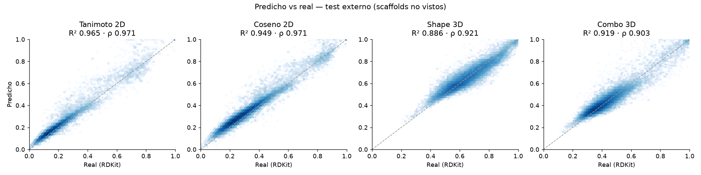

# 🧬 Similitud Molecular Multi-Métrica — Benzimidazoles anti-*Leishmania*

Red neuronal **Siamese CNN** que, dado un compuesto en notación SMILES, predice simultáneamente **cuatro métricas de similitud**
contra **12 benzimidazoles ensayados en laboratorio** (Universidad de Salamanca) y genera un **ranking** para priorizar qué
compuestos estudiar primero en la búsqueda de tratamientos contra la leishmaniasis.

**▶ App web (se ejecuta en el navegador, sin servidor):** https://hellenp-a.github.io/SIMILITUDMOLECULAR/

> Mide **similitud estructural, no actividad biológica**. Es un filtro de priorización reproducible que orienta el trabajo de
> laboratorio; no lo reemplaza.

Proyecto PIA-02 · Hellen Pamela Aguilar Noguera · CENFOTEC + Universidad de Salamanca.

---

## Las cuatro métricas

| Métrica | Tipo | Qué mide |
|---|---|---|
| **Tanimoto 2D** | 2D | Fragmentos compartidos entre fingerprints Morgan ECFP4 (radio 2, 2048 bits) |
| **Coseno 2D** | 2D | Ángulo entre los mismos fingerprints |
| **Shape 3D** | 3D | Solapamiento de volumen gaussiano del mejor alineamiento de confórmeros (enfoque ROCS) |
| **Combo 3D** | 3D | (Shape + Color) / 2 — forma + coincidencia de grupos farmacofóricos |

**Score final** (pesos ajustables en las apps): `0.35·Tanimoto + 0.25·Coseno + 0.20·Shape + 0.20·Combo`

## Resultados

Evaluación **externa por scaffold**: el conjunto de prueba contiene solo moléculas cuyo esqueleto de Bemis-Murcko nunca
apareció en entrenamiento (3,287 moléculas, 44,374 pares). Es una prueba más exigente que la partición aleatoria por par del PIA-02.

| | PIA-02 (documento) | Esta versión |
|---|---|---|
| Validación | aleatoria por par (interna) | **externa por scaffold** |
| Pares | 48,462 | **377,082** |
| Datos 3D | OpenEye ROCS (licencia) | RDKit `rdShapeAlign` (abierto, reproducible) |
| R² promedio | 0.9353 | **0.9297** |
| Spearman promedio | 0.9724 | **0.9416** |
| MAE promedio | 0.0180 | **0.0282** |
| Identidad (molécula vs sí misma) | ≈ 0.62 | **0.9999** (sin atajos) |
| Score final: R² / Spearman | — | **0.963 / 0.963** |

Por métrica (test externo, con aumento en inferencia):

| Métrica | R² | Spearman | Kendall τ | MAE | RMSE |
|---|---|---|---|---|---|
| Tanimoto 2D | 0.965 | 0.971 | 0.866 | 0.021 | 0.031 |
| Coseno 2D | 0.949 | 0.971 | 0.865 | 0.029 | 0.037 |
| Shape 3D | 0.886 | 0.921 | 0.767 | 0.034 | 0.045 |
| Combo 3D | 0.919 | 0.903 | 0.740 | 0.029 | 0.040 |

**Calidad del ranking** (por referencia, sobre los candidatos de test, contra el Score multi-métrica real):

| Método | Spearman | NDCG@10 | NDCG@100 | Precision@100 |
|---|---|---|---|---|
| Modelo (4 métricas) | **0.957** | 0.980 | **0.988** | **0.814** |
| Solo Tanimoto 2D exacto (tipo PubChem/ChEMBL) | 0.870 | 0.980 | 0.983 | 0.779 |

Ordenar solo por Tanimoto 2D reproduce peor el ranking multi-métrica (Spearman 0.87 vs 0.96). En el top-10 estricto la línea base
es comparable (Precision@10 0.69 vs 0.65).

**¿El modelo aprende información 3D real?** Una regresión lineal que intenta deducir las métricas 3D a partir de las 2D exactas
logra R² 0.24 (Shape) y 0.55 (Combo); la red neuronal logra **0.87** en ambas. La red no está copiando el 2D.

**Controles:** simetría exacta por construcción (|f(a,b) − f(b,a)| = 0), variación por escritura del SMILES 0.008, y error que
crece al alejarse del dominio de entrenamiento (MAE 0.026 → 0.030).

| Compuesto | Mejor referencia | Score modelo | Score exacto |
|---|---|---|---|
| BZ-6 (referencia) | BZ-6 | 1.000 | 1.000 |
| Análogo de BZ-6 sin butilo | BZ-3 | 0.829 | 0.850 |
| Albendazol | BZ-6 | 0.558 | 0.529 |
| Mebendazol | BZ-2 | 0.565 | 0.562 |
| Miltefosina | BZ-6 | 0.284 | 0.283 |
| Aspirina (control negativo) | BZ-2 | 0.331 | 0.299 |



Todas las métricas están en [`reports/metrics.json`](reports/metrics.json).

## Mejoras respecto al PIA-02

1. **Validación externa por scaffold** en lugar de partición aleatoria por par, que era lo que el PIA-02 dejó como trabajo futuro.
2. **8× más datos**: el set ChEMBL completo del PIA-02 (20,095 compuestos) más 9,093 señuelos de ChEMBL 35 (fármacos aprobados
   y compuestos diversos), para que el modelo aprenda a discriminar lo no relacionado.
3. **3D real para todos los pares**, sin valores estimados, con ensambles de 10 confórmeros ETKDGv3 + MMFF y el mejor ComboScore.
   El cálculo usa RDKit (código abierto), así que cualquiera puede reproducirlo sin licencia de OpenEye.
4. **Identidad resuelta en el entrenamiento**: pares de identidad escritos con SMILES distintos en cada lado, sin parche en la app.
5. **Aumento con SMILES aleatorizados** en el entrenamiento y en la inferencia (TTA), con **incertidumbre** (desviación estándar).
6. **Arquitectura simétrica por construcción** (`[a+b, |a−b|, a·b]`), pooling enmascarado y tronco multitarea compartido.
7. **Dominio de aplicabilidad**: similitud con el vecino más cercano del entrenamiento y el error esperado.
8. **Métricas de ranking** (NDCG@k, Precision@k), Kendall, RMSE y líneas base de comparación.
9. **Dos apps**: web estática en GitHub Pages (RDKit.js + ONNX Runtime Web) y Streamlit con verificación exacta 2D/3D, lote y
   resaltado de la subestructura común máxima.

## Arquitectura

```
SMILES ─► tokenizador regex ─► Embedding(73→64) ─► Conv1D k=3 ┐
                                                  Conv1D k=5 ├─► max+mean pooling ─► Linear(768→256)+LayerNorm = embedding
                                                  Conv1D k=7 ┘        (encoder compartido para ambas moléculas)
[ea+eb, |ea−eb|, ea·eb] ─► Linear(768→256) ─► 4 cabezas MLP + sigmoid ─► Tanimoto, Coseno, Shape, Combo
```

835,908 parámetros · pérdida Huber ponderada (1.5/1.2/0.8/1.0) · AdamW + OneCycle · muestreo balanceado por similitud ·
early stopping por Spearman de validación (mejor época: 53).

## Uso

### App web
Abrir https://hellenp-a.github.io/SIMILITUDMOLECULAR/. Todo se calcula en el navegador, así que los SMILES no salen del equipo.

### Streamlit (local)
```bash
python3.11 -m venv .venv && source .venv/bin/activate
pip install -r requirements.txt
streamlit run app.py
```
Para publicarla en [Streamlit Community Cloud](https://share.streamlit.io): *New app* → este repositorio → `app.py`.
Solo necesita `requirements.txt`, porque la inferencia usa ONNX Runtime y no requiere PyTorch.

### Reproducir el pipeline completo
```bash
pip install -r requirements-train.txt
python scripts/step1_prepare_data.py   # moléculas, partición por scaffold, pares y 4 métricas (~40 min, 10 núcleos)
python scripts/step2_train.py          # entrenamiento (~100 min en Apple M5 / MPS)
python scripts/step3_evaluate.py       # reports/metrics.json + figuras
python scripts/step4_export.py         # models/similarity.onnx + docs/assets (app web)
pytest tests
```

## Estructura

```
molsim/          paquete: química (RDKit), tokenizador, modelo, métricas, predictor ONNX
scripts/         pipeline step1 → step4
app.py           app Streamlit
docs/            app web estática (GitHub Pages)
models/          best_model.pt, similarity.onnx, tokenizer.json, model_card.json, domain_fps.npy
data/raw/        datos fuente (ChEMBL)
data/processed/  moléculas y pares con las 4 métricas
reports/         metrics.json y figuras
```

## Datos y referencias

- **Referencias:** tabla *Benzimidazoles ensayados frente a varias spp de Leishmania* (USAL). **Corrección de BZ-3:** el SMILES
  de la tabla omitía el doble enlace C=N del imidazol (forma 2,3-dihidro, C13H11ClN4O, MW 274.71). La figura de la misma tabla muestra el
  benzimidazol aromático, que es el que se usa aquí: `O=C(Nc1nc2cc(Cl)ccc2[nH]1)c1ccccn1` (C13H9ClN4O, MW 272.69).
  El compuesto 141 tiene 80 % de inhibición a 10 µM (sin IC50).
- **ChEMBL** (Gaulton et al., 2017), licencia CC BY-SA 3.0: `chembl_tanimoto_v2_consolidado.csv` (set del PIA-02) y señuelos de ChEMBL 35.
- Rogers & Hahn (2010) ECFP · Weininger (1988) SMILES · Grant & Pickup (1995) / ROCS para similitud gaussiana de forma ·
  Bemis & Murcko (1996) scaffolds · RDKit.

## Limitaciones

- Predice similitud estructural, **no actividad biológica** ni toxicidad.
- Las métricas 3D de esta versión provienen de RDKit y no de OpenEye ROCS. Siguen el mismo enfoque, pero los valores no son idénticos.
- Es más confiable cerca del dominio de entrenamiento (benzimidazoles y afines). Fuera de él, la app lo indica.
- Trabajo futuro: validación experimental del top del ranking, modelos de actividad con IC50 y predicción ADME/PK.
